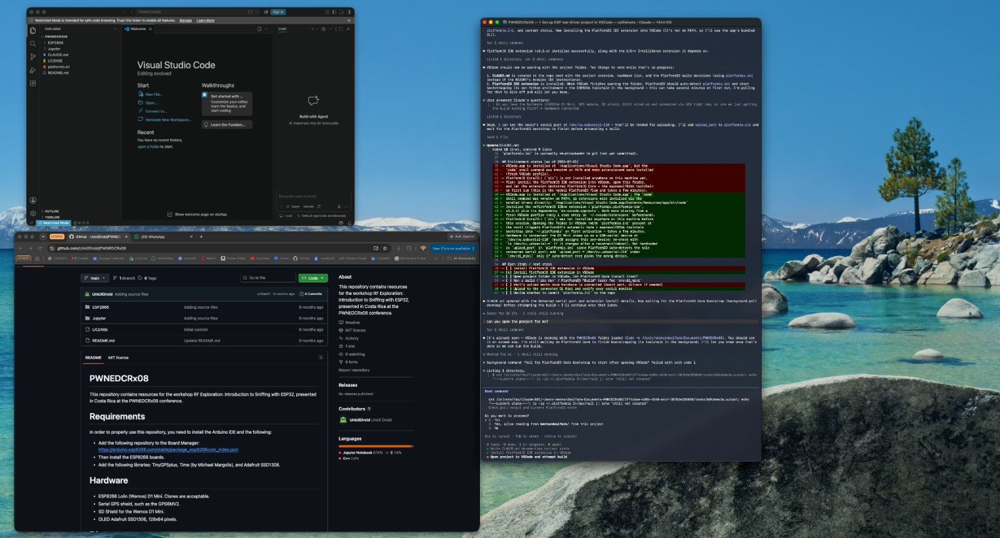
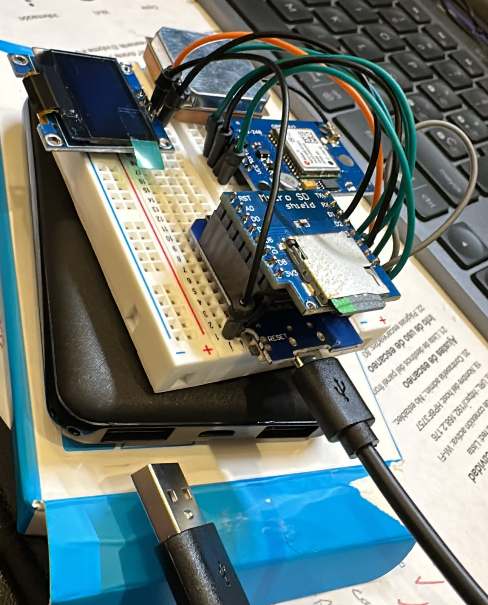
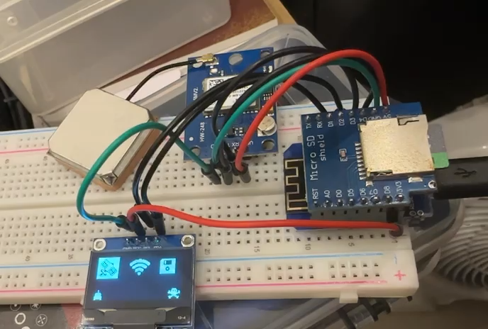

Last year I attended **PWNED 0x08**, a cybersecurity conference here in Costa Rica, and signed up for
the workshop *"RF Exploration: Introduction to Sniffing with ESP32/ESP8266."* The goal was simple and
very fun: build a pocket-sized **wardriver**, a device that listens for Wi-Fi networks around you,
tags each one with a GPS position, logs everything to an SD card and shows its status on a small
screen.

I walked out of that workshop with a bag of parts and a project I hadn't finished.

This post covers how I picked it back up almost a year later, what broke along the way, and the
feature I wanted to add to the original project.

---

## The hardware

The build is intentionally cheap and simple:

| Part | Role |
|---|---|
| **Wemos/Lolin D1 Mini** (ESP8266) | The brain. Puts the Wi-Fi radio in *promiscuous mode* to sniff 802.11 management frames |
| **GPS module** (GY-GPS6MV2 / NEO-6M) | Supplies latitude, longitude, altitude and time for every capture |
| **Micro SD shield** for the D1 Mini | Stores the CSV logs |
| **SSD1306 OLED**, 128×64, I2C | Live status: GPS, network count, SD state |

The workshop code lives in the [PWNEDCRx08 repository](https://github.com/UnicliDroid/PWNEDCRx08),
and builds on [ESPProLib](https://github.com/RicardoOliveira/ESPProLib) for the promiscuous-mode
sniffing.

## Why it didn't get finished at the conference

My laptop gave me trouble during the workshop. I had prepared everything the day before; everything I 
needed to work on the project was installed, and everything was up to date. But as soon as we sat down and the workshop began, the only IDE that would open was the 'default' version -the old one that came with the operating system and had no plugins available-. All the necessary plugins had been installed on the newer version. No one was able to get it to open the correct one. I spent the entire session troubleshooting, so I never flashed the board. 
While everyone else was watching their screens fill up with networks, I was still fighting with my setup.
I took the parts home, and they ended up sitting in a box for most of a year.

## Picking it back up, with an AI pair

With PWNED coming up again this year -and partly because I bought a T-Embed CC1101 Plus to experiment with (more on this
in an upcoming post)-, I got excited and decided to pick up the wardriving project again. When I came back to it, I did two things differently.

**1. I ditched the Arduino IDE for VS Code + PlatformIO.** The repo's README is written for the
Arduino IDE, but I wanted builds inside my editor. PlatformIO also makes the build reproducible,
because the board, framework, serial speed and library versions all go in one `platformio.ini`:

```ini
[platformio]
src_dir = ESP2866

[env:d1_mini]
platform = espressif8266
board = d1_mini
framework = arduino
monitor_speed = 115200
lib_deps =
    mikalhart/TinyGPSPlus
    paulstoffregen/Time
    adafruit/Adafruit SSD1306
    adafruit/Adafruit GFX Library
    adafruit/Adafruit BusIO
```

**2. I worked through it with an AI coding assistant** (Claude Code, running in my terminal next to
VS Code). I stayed in charge of the hardware, the wiring, the testing and every decision. The
assistant was a fast pair partner. It read the code, explained what it was doing, and helped me
debug step by step.


*VS Code on the left, the original workshop repo below it, and the AI session on the right.*

### First bug: code that no longer compiled

The first build failed right away with this error:

```cpp
#if (SSD1306_LCDHEIGHT != 64)
#error("Incorrect screen height, fix Adafruit_SSD1306.h");
#endif
```

That guard was left over from an old Adafruit SSD1306 library. Current versions only define
`SSD1306_LCDHEIGHT` if you opt into a legacy macro, which the sketch never did. The sketch already
used the modern constructor that takes the width and height directly
(`Adafruit_SSD1306 display(128, 64, &Wire, -1)`). The macro was always undefined, so the error
always fired. I removed the dead check and the build passed.

**Lesson:** workshop code is a snapshot in time. Libraries move on, and a year is plenty of time for
something to break.

## Troubleshooting: a dark screen and silent satellites


*The first assembly: everything plugged in, but the OLED stayed dark.*

### The OLED showed nothing

The board flashed and the serial monitor showed the sketch running. The screen stayed black.

Instead of guessing, I added a temporary **I2C scanner** to `setup()`. It checks every address on
the bus and prints what answers. The result was always the same: *"No I2C devices found."*

That result ruled out a large group of causes. The problem wasn't the display library, the address
(`0x3C`) or the code. If nothing answers on the bus at all, the problem is physical. I also had a
theory that the stacked SD shield might not expose D1/D2 (the I2C pins) properly. 

So I **took the wiring apart and rewired everything from scratch.** The next scan printed
`I2C device found at 0x3C`, and the boot logo appeared. The cause was a bad or missing connection
somewhere in the original wiring. I removed the debug scanner and reflashed the clean sketch.

**Lesson:** when a bus scan finds *nothing*, check the wiring before you touch the code.

### The GPS wouldn't get a fix

By design, the sketch waits in `setup()` until the GPS reports a valid location before it starts
logging. On my first outdoor test, the satellite count stayed at **0** for several minutes.

A cold front was passing over Costa Rica those days, with heavy clouds and storms. A GPS module
doing a *cold start* (no saved satellite data) is very sensitive to a weak sky view. Since the GPS
wiring had already been redone once, I didn't want to start taking things apart again without a
reason. I waited for better weather.

A few days later, under a clearer sky, the module found its satellites and the wardriver started
logging. My first real walk captured **5,821 packets across 94 GPS points.**


*After the rewire: the OLED shows GPS, Wi-Fi and SD status.* ([short video](images/working-oled.mp4))

**Lesson:** not every failure is a bug. Before you start changing things, rule out the environment:
sky view, weather, cold start and time to first fix.

## The feature I wanted: security type per access point

With everything working, I looked at my first logs and realized something important was missing. The
wardriver recorded **what** networks existed and **where**, but not **how they were protected**. For
a security-focused tool, that's the most interesting column.

The original code had a `getEncryption()` function, but it was dead code. It called
`WiFi.encryptionType()`, which only works with the ESP8266's *active scan* API. This sketch sniffs
passively in promiscuous mode, so that call could never return anything useful.

So I built the feature properly by parsing the raw 802.11 frames. Every **Beacon** and **Probe
Response** an access point sends includes the information needed to classify it:

1. **Capability Information → Privacy bit (`0x0010`).** If it isn't set, the network is **Open**.
2. **RSN Information Element (tag 48).** If present, the network is WPA2 or WPA3. Walking its
   **AKM suite list** tells them apart:
   - AKM `1`, `2`, `5`, `6` (802.1X / PSK) → **WPA2**
   - AKM `8`, `9`, `24` (SAE / FT-SAE / SAE-EXT) → **WPA3**
   - Both → **WPA2/WPA3 transition mode**
3. **Vendor-specific IE (tag 221) with OUI `00:50:F2`, type `1`** → legacy **WPA**.

```cpp
String getSecurityType(esppl_frame_info *info) {
  bool privacy = info->capability_info & 0x0010;
  if (!privacy) return "Open";
  if (info->has_rsn) {
    String s;
    if (info->has_wpa3_akm) {
      s = info->has_wpa2_akm ? "WPA2/WPA3" : "WPA3";
    } else {
      s = "WPA2";
    }
    if (info->has_wpa_vendor) s = "WPA/" + s;
    return s;
  }
  if (info->has_wpa_vendor) return "WPA";
  return "Encrypted(?)";
}
```

A new `Security` column was added to the CSV log.

### The hardware limit I hit (and why `Encrypted(?)` exists)

Here's the most interesting part technically. The ESP8266 SDK's promiscuous callback only gives you
the **first 112 bytes** of a management frame body, however long the real frame is. The original
tag-parsing loop was bounded by a length value that reflected the SDK's *struct size*, not the real
data. Parsing further meant reading unrelated memory and treating it as fake tags. I fixed the loop
so it stops at the 112-byte window.

Some access points send long beacons, with long SSIDs and many rate and vendor tags. In those, the
RSN tag falls **after** the cutoff. The privacy bit says "encrypted," but the details aren't visible.

I had to decide how to label those. The tempting answer is "WEP," because privacy is on and no
WPA/RSN tag is visible. In 2026 that would almost always be wrong. A truncated WPA2 beacon is far
more likely than a real WEP network. So the firmware labels those networks **`Encrypted(?)`**. It
reports what it actually knows and doesn't guess.

**Lesson:** a tool that labels uncertain results honestly is more useful than one that fills gaps
with plausible guesses.

## From CSV to a readable report

Raw CSV logs are hard to read. I added a post-processing step that turns each walk into a
**landscape PDF report**: one row per access point, with SSID, security type, BSSID, channel, packet
count, best and average RSSI, first and last time seen, and location.

### Detecting meshes and multi-SSID radios

A single physical router often broadcasts several networks: main, guest, hidden, a setup SSID. Mesh
systems add more. Listing each of those separately would inflate the numbers and make the report
confusing.

This was harder than expected because the sniffer's CSV **drops leading zeros in MAC address
bytes**. BSSIDs from the same radio can end up with different string lengths, so a simple
comparison doesn't work. The merge rule that proved reliable was:

> **Same channel + BSSID hex suffix match of at least 6 characters → same physical radio.**

With this rule, the main network, guest network and hidden variants of one router merge into one
row. Separate mesh nodes (for example a 3-node mesh system) **stay as separate rows**, because they
are separate radios in separate locations. That's what you want on a map.

### What a walk looks like

On the second field walk, with the security feature running, the report found **about 60 physical
access points**:

- Most of them (~¾) used **WPA2**
- A handful were **`Encrypted(?)`** (truncated beacons, see above)
- **2 WPA3**, **2 legacy WPA**, **1 WPA2/WPA3 transition**
- **1 completely Open** network

WPA3 adoption in a real residential area is still tiny, and legacy WPA is still around. That alone
made the feature worth building.

> **A note on ethics and privacy:** I only captured passive broadcast frames (beacons and probe
> responses) that access points send to everyone. I never connected to, attacked or tried to
> authenticate against any network. The raw logs contain real coordinates and neighbors' network
> names, so they stay offline. They're excluded from the repo, and no SSIDs, MACs or locations
> appear in this post. If you build one, check your local laws and treat the data carefully.

## Takeaways

- **Unfinished projects aren't failures.** They're paused. A year later, with better tools and more
  patience, it came together.
- **Isolate the layer before you debug.** The I2C scanner separated a wiring fault from a code fault
  in one step.
- **Rule out the environment.** My "broken" GPS was a cold start under storm clouds.
- **AI helps most when you stay in the loop.** I held the multimeter, did the rewiring, walked the
  neighborhood and made the design calls (like refusing to guess "WEP"). The assistant sped up
  reading, explaining and writing code.
- **Build the feature you actually want.** The most useful part of this device is now the part that
  wasn't -or maybe just wasn't working-, in the original repo.

Thanks to the PWNED 0x08 organizers and the workshop instructor for the project that started all of
this. See you at the next one, hopefully with a working laptop this time.

---

*Hardware: Wemos D1 Mini · NEO-6M GPS · SSD1306 OLED · Micro SD shield*
*Tooling: VS Code · PlatformIO · Claude Code*
