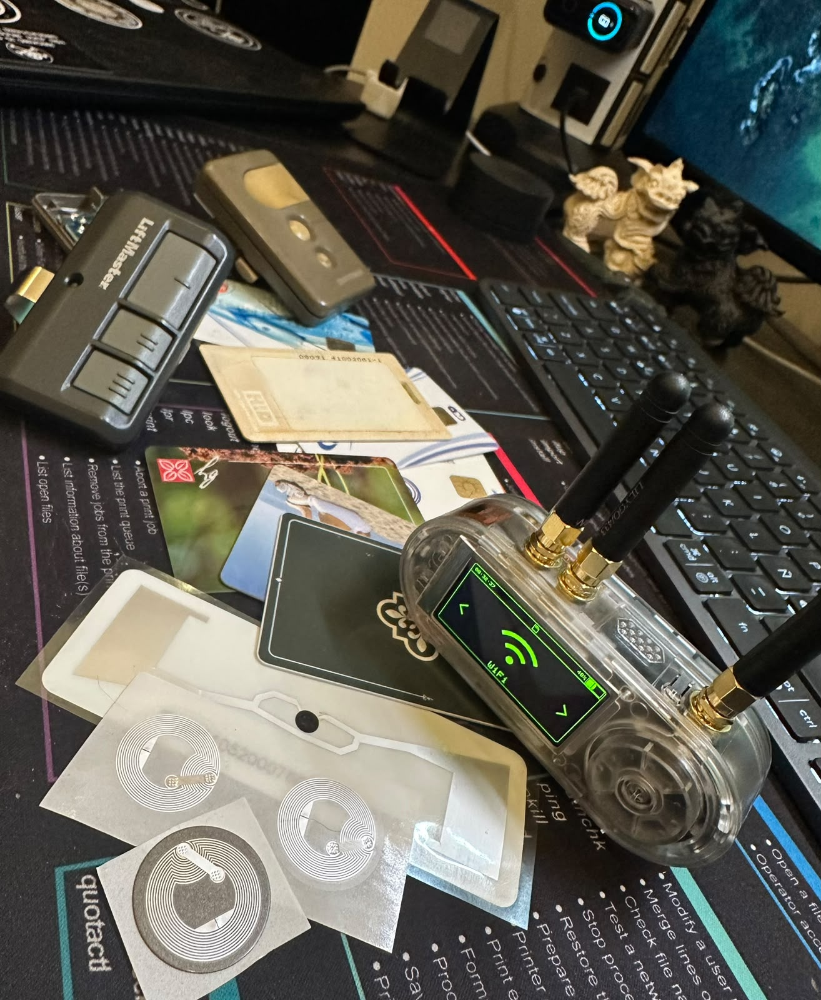
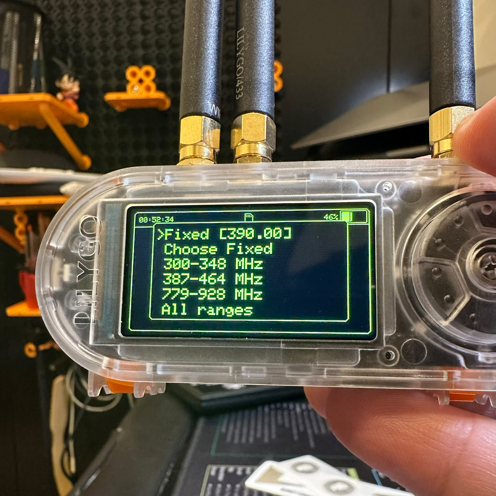
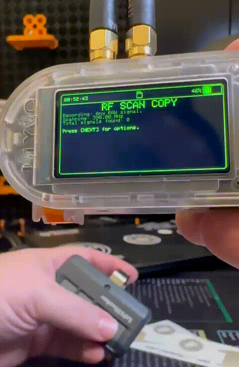
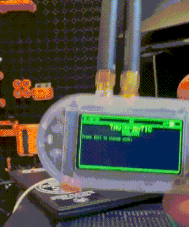
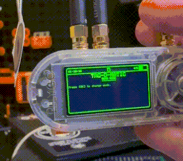
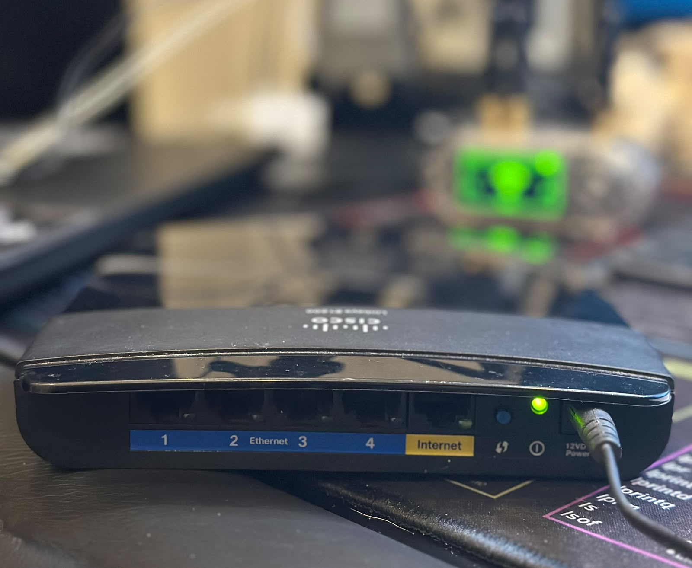
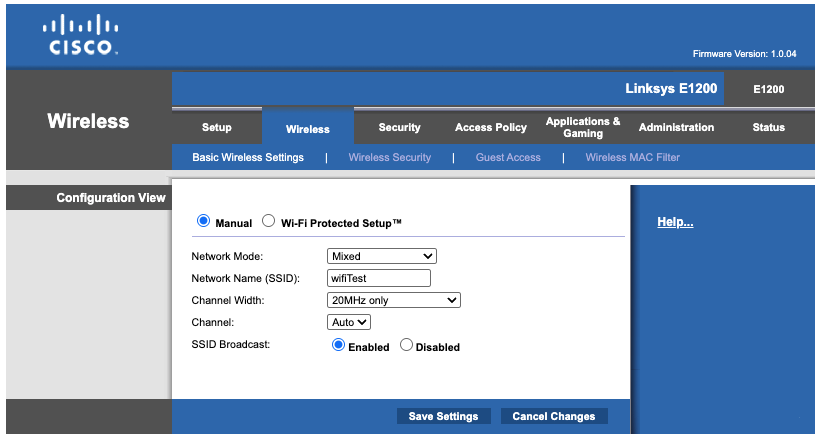
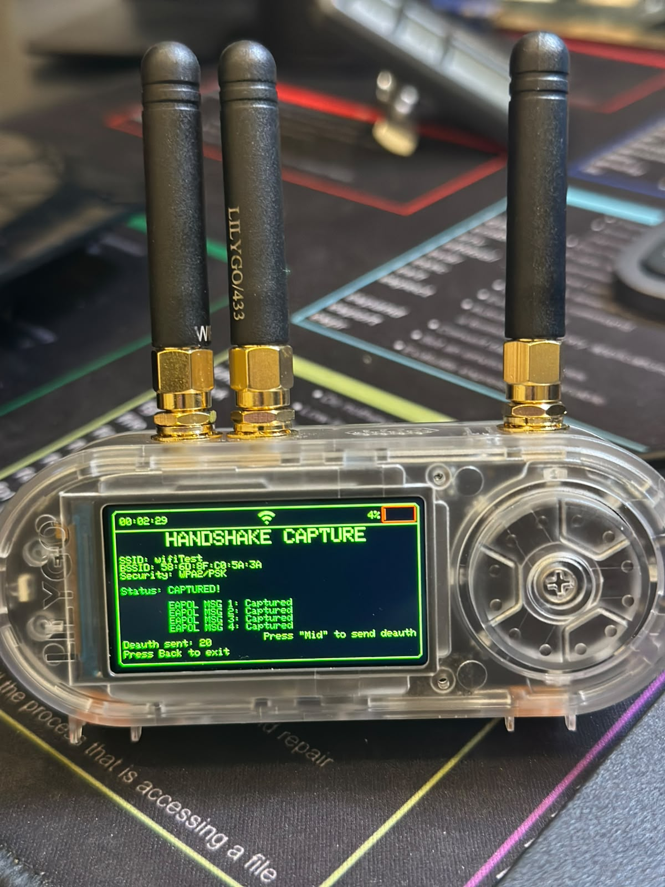
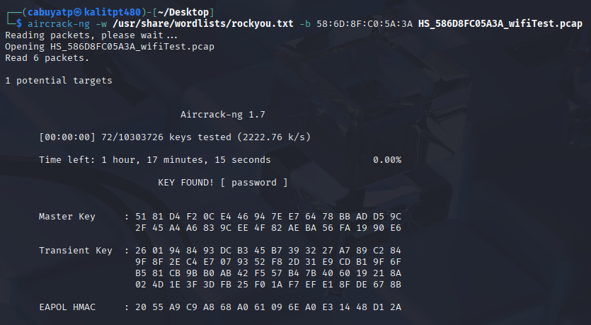

I bought a new toy: a **LilyGO T-Embed CC1101 Plus**. It's a pocket-sized, battery-powered
multi-radio tool in a clear case, with a little scroll wheel and three antennas. Think of it as a
Swiss Army knife for the airwaves: sub-GHz radio, Wi-Fi, Bluetooth and NFC/RFID in one device you
can drive with your thumb.



I didn't buy it just to collect gadgets. Three capabilities sold me on it:

- **Wi-Fi testing** — I wanted a hands-on way to learn how Wi-Fi attacks actually work.
- **Bluetooth testing** — same reason, next radio down.
- **Sub-GHz signal copying** — and this one is genuinely useful to me, not just a lab exercise.

Let me explain that last one, because it's the reason I reached for my wallet.

## Why signal copying is actually useful to me

At my parents' house I have a remote for the garage. Fine. But they also own a property up in the
mountains, behind a **community gate** that sits before their own gate, and I don't have a remote
for the community one. They go up often, and whenever I want to join them *after* they've already
arrived, someone has to walk a long way down just to let me in, sometimes even at night. Being able to copy that remote and
carry a clone would save everyone the hike.

Same story at my wife's grandmother's place: sometimes there's no cell signal out there, so
"text us and we'll open the gate" simply doesn't work once you're standing at it. A clone in my
pocket solves a real, boring, everyday problem.

> **On permission:** every signal I copy is one I have permission to copy. Cloning a remote for a
> gate you're authorized to use is convenience; doing it to one you're not is theft, plain and
> simple. This whole post is me testing on my own gear and my own family's access, with consent.
> Do the same.

With that out of the way, here's how the first round of testing went across three of the radios.

## Test 1 — Sub-GHz RF (the CC1101)

The star of the show is the **CC1101** sub-GHz transceiver. Most garage and gate remotes live down
in the 300–928 MHz band, and the T-Embed can scan those ranges, capture a signal, and replay it.



For my first test I used the **remote for my parents' garage**. You drop into *Scan/Copy*, pick a
frequency range (in my experience, it's best to use a fixed frequency), and hold the remote near the device while pressing its
button. The T-Embed listens for a signal to lock onto and record.



**The honest result:** this is where you learn that not all remotes are equal.

- **Fixed-code remotes** — common on simpler community and property gates — send the *same* code
  every time. Capture once, replay forever. These are the ones a tool like this can genuinely clone.
- **Rolling-code remotes** — most modern garage openers change the code on every press. You
  can record a transmission, but replaying it won't work, because the receiver has already moved on.
  That's the whole point of rolling codes, and it's a good thing.

Luckily, both controllers tested seem to be old tech, exactly the kind of fixed-code system this shines on. 

## Test 2 — RFID / NFC

Next radio: the **13.56 MHz RFID/NFC** reader, which the T-Embed calls *Tag-O-Matic*. I threw two
very different cards at it.

**A hotel key card.** The reader identified the card type and then hit a wall:



*"Failed reading data blocks."* That's not a bug, it's the card's security doing its job. The data
sectors are protected with keys the reader doesn't have, so it can see the card exists but can't
pull the contents. Exactly what you'd want from a card that unlocks a room.

**A blank NFC tag.** Completely different story:



An unprotected tag reads instantly, blocks and all. Next on my list is testing whether the T-Embed
can *write* to one of these, though I'll admit I don't yet have a use for that. Sometimes you learn
the capability first and find the reason later.

The takeaway: the reader isn't magic. A well-secured card stays secured; an open tag is an open book.

## Test 3 — Wi-Fi handshake capture (my favorite)

This is the one I was most excited about. I dug out an **old Cisco/Linksys E1200 router**, set it up
as a throwaway Wi-Fi network, and used it as a target I fully own.



I created a network called **`wifiTest`** with WPA2, purely to practice the capture-and-crack
workflow end to end.



### A quick word on the deauth process

To crack a WPA/WPA2 password offline you first need to capture the **4-way handshake**, the short
exchange (EAPOL messages) a device and the router perform when the device *joins* the network. The
problem: that only happens at connection time, and you can't just wait around forever.

Enter the **deauthentication ("deauth") attack**. In WPA2, the management frames that tell a client
"you've been disconnected" are **not authenticated**, anyone can forge them. So the attacker sends
spoofed deauth frames that look like they came from the router, kicking a connected device off the
network. The device, being helpful, immediately tries to **reconnect**, and *that's* when it
performs the handshake again, right in front of your capturing radio.

In short: **deauth to force a reconnect → capture the handshake → crack it offline.** You never need
to be connected to the network, and the cracking happens later on a laptop, not on the device.

Modern defenses exist: **WPA3** and **802.11w (Protected Management Frames)** authenticate those
management frames, which shuts this technique down. My little E1200 has neither, which is exactly why
it made a good teaching target.

### Capturing the handshake

The T-Embed has a dedicated handshake-capture mode. Point it at the network, fire off some deauth
frames, and wait for a client to reconnect:



```
HANDSHAKE CAPTURE
SSID: wifiTest
BSSID: 58:6D:8F:C0:5A:3A
Security: WPA2/PSK
Status: CAPTURED!
  EAPOL MSG 1: Captured
  EAPOL MSG 2: Captured
  EAPOL MSG 3: Captured
  EAPOL MSG 4: Captured
Deauth sent: 20
```

All four EAPOL messages, a complete handshake, saved to a `.pcap` file. That's the hard part done.

### Cracking it

From here it's a standard offline job. I moved the capture to my Kali machine and ran it through
**aircrack-ng** against the classic `rockyou.txt` wordlist:



```
Aircrack-ng 1.7
[00:00:00] 72/10303726 keys tested (2222.76 k/s)
                  KEY FOUND! [ password ]
```

**`KEY FOUND! [ password ]`** — cracked in well under a second, because I'd deliberately set the
password to `password`. That's the point being made: the capture works regardless, and after that
your only defense is a password that *isn't* in a wordlist. A weak password falls instantly; a long,
random one turns "offline crack" into "offline wait a few million years."

## What's next

The three radios were only the beginning. The thing that keeps pulling me back to the T-Embed is
that it's **programmable**, it's not a fixed-function appliance, it's a platform you can build on.

So there's a project brewing. I want to add a **GPS antenna** and write a **listening mode** that
watches the probe requests from devices nearby, the little "is my network here?" calls phones
broadcast, and analyzes which known networks they're looking for. Wardriving, but for the devices
instead of the access points.

More on that in a future post. For now: one gadget, three radios, and a much better feel for how
the invisible traffic around us actually works.

---

*Hardware: LilyGO T-Embed CC1101 Plus · Linksys E1200 (test AP) · Kali Linux · aircrack-ng*
*All testing performed on my own equipment and access, with permission.*
